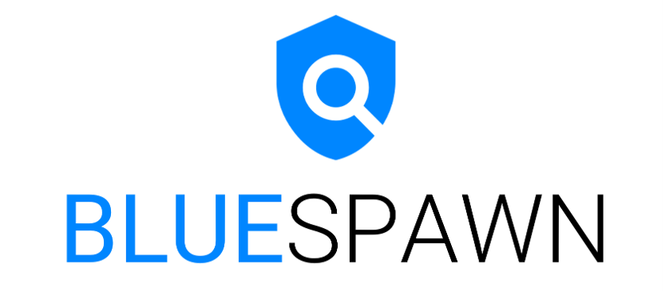

.. BLUESPAWN documentation master file, created by
   sphinx-quickstart on Sun Apr 11 17:49:40 2021.
   You can adapt this file completely to your liking, but it should at least
   contain the root `toctree` directive.

*************************************
Welcome to BLUESPAWN's documentation!
*************************************

Our Mission
===========

BLUESPAWN helps blue teams monitor systems in real-time against active attackers by detecting anomalous activity

What is BLUESPAWN
=================

BLUESPAWN is an **active defense** and **endpoint detection and response tool** which means it can be used by defenders to quickly **detect**, **identify**, and **eliminate** malicious activity and malware across a network.

Get Involved & Contribute to the project
========================================

Want to help make BLUESPAWN even more effective at locating and stopping malware? Join us on `the BLUESPAWN Discord Server <https://discord.gg/JMxPPfZ>`_ and help with development or even just suggest a feature or report a bug. No experience required - there's no better way to learn about development or security than by just jumping right in!

If you'd like to help contribute code, you can get started by checking out our wiki page on `setting up your development environment <https://github.com/ION28/BLUESPAWN/wiki/Setting-up-your-Development-Environment>`_. Please feel free to reach out to us in Discord if you run into any problems getting set up! We generally track bugs and new features through Issues and coordinate in chat when doing any development work.

Why we made BLUESPAWN
=====================

We've created and open-sourced this for a number of reasons which include the following:

- **Move Faster**: We wanted tooling specifically designed to quickly identify malicious activity on a system
- **Know our Coverage**: We wanted to know exactly what our tools could detect and not rely on blackbox software as much (ie AV programs). This approach will help us to better focus our efforts on specific lines of effort and have confidence in the status of others.
- **Better Understanding**: We wanted to better understand the Windows attack surface in order to defend it better
- **More Open-Source Blue Team Software**: While there are many open-source Red Team Tools out there, the vast majority of some of the best Blue Team tools are closed-source (ie, AVs, EDRs, SysInternals, etc). We shouldn't need to rely on security through obscurity to prevent malicious actors (obviously very difficult, but something to strive for!)
- **Demonstrate Features of Operating System APIs**: We combed through a ton of Microsoft Documentation, StackOverflow Answers, and more to create this. Hopefully others may find some of the code useful.

.. toctree::
   :maxdepth: 0
   :hidden:
   :caption: Home

   Home <index>

.. toctree::
   :maxdepth: 2
   :hidden:
   :caption: BLUESPAWN Information

   bluespawn_information/contact_us
   bluespawn_information/sponsoring
   bluespawn_information/licensing
   bluespawn_information/contributors
   bluespawn_information/publications

.. toctree::
   :maxdepth: 3
   :hidden:
   :caption: BLUESPAWN Features

   bluespawn_features/hunts
   bluespawn_features/scan_mode
   bluespawn_features/mitigations
   bluespawn_features/reactions
   bluespawn_features/logging_and_output
   bluespawn_features/agent7_integration

.. toctree::
   :maxdepth: 2
   :hidden:
   :caption: Using BLUESPAWN

   using_bluespawn/getting_started
   using_bluespawn/examples_of_bluespawn_in_action
   using_bluespawn/using_mitigations

.. toctree::
   :maxdepth: 2
   :hidden:
   :caption: BLUESPAWN Development

   bluespawn_development/getting_involved
   bluespawn_development/setting_up_your_development_environment
   bluespawn_development/software_architecture_info
   bluespawn_development/project_roadmap

